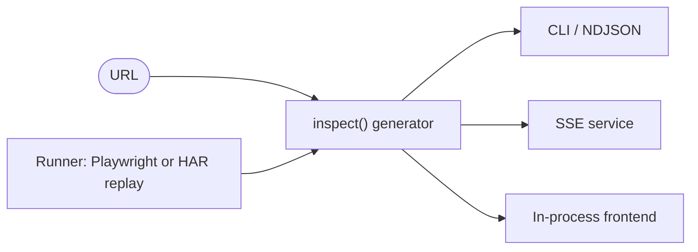

# @blueconic/inspector

A URL goes in; a live stream of what a prospect's ecommerce marketing stack is actually doing comes out.

> [!NOTE]
> Internal BlueConic prototype, built by Slalom. Not open source, and not accepting external contributions.

`@blueconic/inspector` inspects the marketing technology on an ecommerce page and reports what's **installed** versus what's **actually firing**. That gap is the whole product. Klaviyo sits on nearly every Shopify store, so "installed" proves capability and nothing more; proving a flow is genuinely sending events is the part worth paying for. Detection streams—findings surface as they're discovered instead of landing in one batch at the end—so a terminal, an SSE client, or a frontend can light up progressively.

## Contents

- [How It Works](#how-it-works)
- [Highlights](#highlights)
- [Requirements](#requirements)
- [Install](#install)
- [Usage](#usage)
- [SSE Service](#sse-service)
- [Project Layout](#project-layout)
- [Development](#development)
- [Deployment](#deployment)
- [License](#license)

## How It Works

One entry point, `inspect(url)`, is an async generator. It drives a headless browser (or a replayed capture) through six phases—resolve, fetch, render, collect, classify, score—and yields typed events as evidence lands.



The browser lives behind a `Runner` interface, so the crawl engine swaps out without touching detection. That seam is what keeps hosting portable: local Playwright runs it today, and AWS AgentCore Browser or Fargate are candidate homes if the tool moves to a service.

Two tiers carry the core claim:

- **present** — the vendor's script or tag is on the page. Cheap to detect, and it says nothing about whether the vendor is used.
- **wired** — a real behavioral or identity beacon fired (Klaviyo `client/events`, Meta `/tr`, Attentive `subscribers`). This is the evidence a flow is live.

A signal re-emits with an upgraded tier when it crosses from present to wired; consumers key by `signal.id` and replace. Categories with zero matches roll up into an explicit absence at the end rather than vanishing. The full shape is the contract in [`src/types.ts`](src/types.ts), the single source of truth the frontend builds against.

## Highlights

- **Streaming detection** — events flow as they're found, over an in-process async generator or SSE.
- **present vs wired** — installed is not firing; the tool separates the two using beacon shapes verified against real captured traffic.
- **Observe-only by default** — the crawler never adds to cart, checks out, or submits a form. A failed or partial look reports `unobserved`, never a false absence.
- **Deterministic replay** — point `--har` at a captured session to see the wired tier with no live crawl. It doubles as the test fixture.
- **Opt-in evasion** — stealth plus simulated browsing for a consenting prospect's own site, off by default and gated on an explicit flag.

## Requirements

- Node >= 24 (`.nvmrc` pins the version)
- npm (the repo pins `npm@11.16.0`)

## Install

```bash
npm install
npx playwright install chromium
```

## Usage

### Replay A Captured Session

The deterministic path, and the fastest way to see the wired tier. A live crawl of a Shopify store mostly reads `present`, because the discriminating beacons are interaction-gated and bot-gated. Replaying a recorded session through the unchanged core sidesteps both:

```bash
npm run inspect -- --har docs/beacon-capture/magicspoon-beacons.json
```

```
▶ docs/beacon-capture/magicspoon-beacons.json
  … fetch
  [present, no use seen] cart.esp.klaviyo (klaviyo)
  [present, no use seen] recs.recs.rebuy (rebuy)
  [present, use unverified] platform.shopify (shopify)
  [present, no use seen] cart.sms.attentive (attentive)
  [wired] recs.recs.rebuy (rebuy) ×16
  [wired] ads.pixel.meta (meta) ×2
  [wired] cart.sms.attentive (attentive) ×5
  [wired] cart.esp.klaviyo (klaviyo) ×36
  … classify
  [absent] identity.__rollup (identity)
✔ 9 signals in 9ms
  absent: exit_intent, identity, email_capture, consent, session_replay, bot_defense
```

> [!NOTE]
> `×N` is a snapshot of matching observations counted the moment a signal last upgraded tier, not a count of beacons fired. A busy vendor can show a small `×N`; read it as activity depth at the upgrade instant.

### Crawl A Live URL

```bash
npm run inspect -- https://example.com/products/some-product
```

Same streaming output, driven by a live Playwright crawl. Which signals reach `wired` depends on what the page actually fires during the visit.

### Emit NDJSON For The Frontend

```bash
npm run inspect -- https://example.com --json
```

Raw newline-delimited `InspectorEvent`s, the reference payload the frontend integrates against. See [`docs/frontend-integration/`](docs/frontend-integration/) for the integration prompt and a sample stream.

### Consume In-Process

```ts
import { inspect } from '@blueconic/inspector';

for await (const event of inspect({ url: 'https://example.com' })) {
	if (event.type === 'signal.found')
		console.log(event.signal.id, event.signal.evidence_of_use);
}
```

### Live Wired Via Opt-In Evasion

> [!WARNING]
> `--active-browse` enables stealth and simulated browsing (scroll, mouse, dwell, never clicks or form fills). It's bot-detection evasion, off by default, and meant only for a prospect's own site with authorization.

```bash
npm run inspect -- https://example.com --active-browse
```

## SSE Service

```bash
npm run serve
# inspector SSE listening on http://localhost:8787/inspect?url=<url>
```

```bash
curl -N 'http://localhost:8787/inspect?url=https://example.com'
```

Frames are `event: <type>\ndata: <json>\n\n`. Set `PORT` to override the port. The route sends the SSE headers immediately and aborts the crawl when the client disconnects, so an abandoned tab doesn't leak a browser.

## Project Layout

| Path                   | What's There                                                              |
| ---------------------- | ------------------------------------------------------------------------- |
| `src/core/`            | the `inspect()` orchestrator and the phase model                          |
| `src/runner/`          | Playwright runner, HAR replay, the opt-in evasion gate                    |
| `src/providers/`       | the ~65-vendor present-tier table and hand-written wired matchers         |
| `src/service/`         | the `node:http` SSE server                                                |
| `src/types.ts`         | the frozen frontend/detection contract                                    |
| `docs/beacon-capture/` | real captured sessions—the source for wired shapes and the replay fixture |

## Development

```bash
npm test           # vitest unit suite
npm run typecheck  # tsc --noEmit, strict
npm run lint       # antfu ESLint (also runs on staged files at commit)
npm run test:e2e   # Playwright
```

Conventions and the decision history live in [`_working-memory/`](_working-memory/) and [`AGENTS.md`](AGENTS.md). Two rules break the product if ignored: `src/types.ts` is a frozen contract (flag deviations, never silently fix), and `core/` and `providers/` never import `service/`.

## Deployment

Local only today. The `Runner` interface keeps the detection core independent of how the browser is hosted, so moving to AWS AgentCore Browser or Fargate changes the runner, not the engine. The target isn't chosen yet.

## License

Internal and client-confidential. Not licensed for distribution. The `ISC` in `package.json` is a scaffold default and does not reflect the intended terms.
